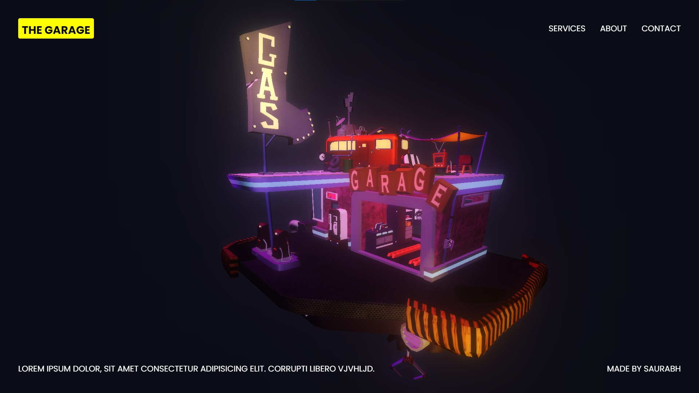

---

# 🚀 **3D Futuristic Garage**  

_A cutting-edge 3D web experience inspired by futuristic themes, showcasing a hyper-realistic garage environment._  

  

---

## 🔥 **Overview**  

**3D Futuristic Garage** is a visually immersive web application that delivers a stunning 3D garage experience. Built with modern web technologies, it’s designed for interactivity and performance, providing users with a glimpse of the future.  


---

## 🌐 **Live Demo**  

🚀 **[View Live Demo](https://saurabh-git-hub.github.io/3D-Futuristic-Garage/)**  
 

---

## 🎯 **Key Features**  

1. 🌌 **Immersive 3D Design**  
   Navigate a hyper-realistic, futuristic garage environment.  

2. 🎨 **Modern Styling**  
   Vibrant neon aesthetics with a visually captivating theme.  

3. 🖱️ **Interactive Experience**  
   Explore the garage with user-friendly controls for zoom and rotation.  

4. 💻 **Responsive Design**  
   Fully optimized for desktops, tablets, and mobile devices.  

5. ⚡ **Seamless Animations**  
   Powered by **GSAP**, enabling smooth and dynamic motion effects.  

---

## 🛠️ **Tech Stack**  

| Technology   | Purpose                          |  
|--------------|----------------------------------|  
| **Three.js** | 3D modeling and rendering        |  
| **GSAP**     | Animations and motion handling   |  
| **HTML5**    | Core structure and content       |  
| **CSS3**     | Responsive styling and layout    |  
| **JavaScript** | Interactivity and functionality |  

---

## 📂 **Project Structure**  

```
3D-Futuristic-Garage/
├── assets/
│   └── 3D-Futuristic-Garage.jpg  # Cover image for preview
├── index.html         # Main HTML file
├── style.css          # CSS styles
├── script.js          # JavaScript for functionality
└── README.md          # Documentation
```

---

## 🚀 **Getting Started**  

### Step 1️⃣: Clone the Repository  
```bash  
git clone https://github.com/Saurabh-git-hub/3D-Futuristic-Garage.git  
cd 3D-Futuristic-Garage  
```  

### Step 2️⃣: Open the Project  
- Open `index.html` directly in your browser to view the project.  

### Step 3️⃣: Run with Live Server (Optional)  
Use a live server for enhanced performance:  
```bash  
npx live-server  
```
---
## 📧 **Contact**  

Feel free to reach out for any queries or suggestions:  
- **Developer:** Saurabh  
- **Email:** saurabh20002004@gmail.com  
- 🌐 **Portfolio:** [saurabh-portfolio.com](https://saurabh-git-hub.github.io/Saurabh-Portfolio/) 

---

## 📝 **License**

This project is licensed to **Saurabh**, the original creator, under the **Creative Commons Attribution 4.0 International License (CC BY 4.0)**.  

You are free to:
- Share: Copy and redistribute the material in any medium or format.
- Adapt: Remix, transform, and build upon the material for any purpose, even commercially.  

Under the following terms:
- Attribution: You must give appropriate credit, provide a link to the license, and indicate if changes were made.  

For more details, visit: [Creative Commons License](https://creativecommons.org/licenses/by/4.0/)  

---
Thanks 🙂
---
